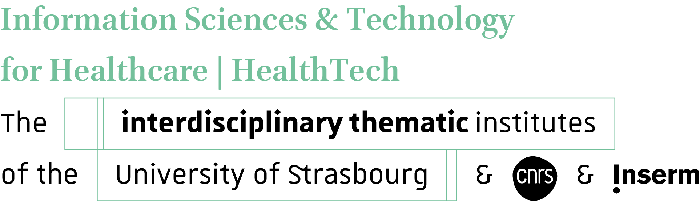

# Se (re)construire dans un monde numérique : Penser les crises à venir et défis futurs

## Génèse du cycle de conférences

Les enjeux climatiques et écosystémiques commencent à être connus et compris de tous. Néanmoins, la réaction individuelle face à l'ampleur des crises à venir peut être plurielle. De plus, le monde avance, de gré ou de force, autour du numérique avec tous les problèmes qu'il soulève, mais aussi les forces qu'il peut nous octroyer. À travers ce cycle de conférences, divers orateurs prendront la parole pour essayer de mieux comprendre et appréhender le moment historique auquel chaque individu fait face. Faut-il bifurquer ? Faut-il s'adapter ? Comment se construire en tant que jeune ou se reconstruire en tant que moins jeune ? Toutes ces questions et bien d'autres encore seront abordées au sein de ce cycle.

# __Conférences Passées__

## Conférence du 22 Janvier 2024. Santé, environnement, technologie : Quels compromis éthiques ?

Pour cette troisième session du cycle de conférence, nous aurons le plaisir d'accueillir 

- **Valérie D'Acremont** Médecin et épidémiologiste, spécialiste en infectiologie et médecine tropicale, Valérie D’Acremont est responsable du secteur Santé globale et environnementale au Centre universitaire de médecine générale et santé publique ([Unisanté](https://www.unisante.ch/fr)). Elle dirige des projets de recherche visant à améliorer la prise en charge des patients vivant dans des pays à ressources limitées ou venant en Europe depuis les tropiques : pour ce faire, elle utilise entre autres des algorithmes d’aide à la décision clinique, qui permettent de réduire fortement la prescription d’antibiotiques et donc l’extension de l’antibiorésistance, tout en s’attelant à limiter l’impact de ces outils sur d’autres enjeux systémiques actuels, comme l’environnement et la cybersécurité.

Résumé : 

*Imaginez que vous soyez un clinicien ou une clinicienne dans un centre de santé d'un pays à ressources limitées. Vos autorités sanitaires ont émis toutes sortes de documents destinés à mettre en application les différentes politiques de santé publique, qui se contredisent entre elles et ne sont pas à jour vu la vitesse à laquelle les épidémies apparaissent. Vous apprenez qu’une tablette intégrant toutes ces recommandations est mise à votre disposition, qui vous guide dans vos prises de décision pendant vos consultations. Mais ces tablettes, obsolètes après trois ans, s'empilent par milliers, les algorithmes se complexifient de jour en jour, les data s'accumulent par millions sur des serveurs locaux souffrant de températures de plus en plus élevées, analysées en continu par une intelligence artificielle générant des émissions de CO2 faramineuses…*

- **Aurore Bontemps** est membre des [Shifters](https://www.theshifters.org/), association de bénévoles qui contribue à diffuser les travaux du [Shift Project](https://theshiftproject.org/) au près des élus et du grand public. A travers une approche systémique, le Shift Project propose des solutions concrètes pour rendre l'économie Française moins dépendante des combustibles fossiles, et lui permettre de suivre une trajectoire de réduction des émissions respectant les accords de Paris. Il a pour cela produit le Plan de Transformation de l'Economie Française ([PTEF](https://theshiftproject.org/crises-climat-plan-de-transformation-de-leconomie-francaise/)) dont Aurore Bomptemps présentera le focus sur le secteur de la santé.

## Conférence du 8 Juin 2023. La Numérisation du Réel : De sa conception philosophique à ses conséquences sociétales
__17h à l'Amphithéâtre du Collège Doctoral Européen (46 Bd de la Victoire, 67000 Strasbourg)__

Cette première conférence sera l'occasion d'accueillir deux orateurs :

- **Guillaume Morano**, Agrégé de Philosophie, enseignant en Classes Préparatoires et auteur du livre "L'Âge du Minotaure, penser la technique". Il nous présentera ses réflexions autour de la "numérisation du réel".
- **Charles Boubel**, Maître de Conférences à l'Université de Strasbourg et chercheur à l'IRMA. Il s'est récemment intéressé aux questions environnementales et à leur intégration au sein du monde de l'université et de la recherche. Il nous présentera sa pensée autour d'une intervention intitulée "Vivre et faire de la science dans une société qui détruit son cadre d'existence".

__Cette conférence sera suivi d'un moment convivial autour d'un pot.__

La conférence a été enregistrée et est disponible en replay en cliquant ci-dessous

## Partenaires

  

### Organisation 
[Thibaut Eloy](mailto:thibaut.eloy@etu.unistra.fr) : PhD Student in Image Analysis, Université de Strasbourg

[Alexandre Stenger](mailto:alstenger@unistra.fr) : PhD Student in Image Analysis, Université de Strasbourg

Charles Parmentier : Master Student in Philosophy, Université de Strasbourg

Luc Vedrenne : PhD Student in Point Cloud Analysis, Université de Strasbourg
